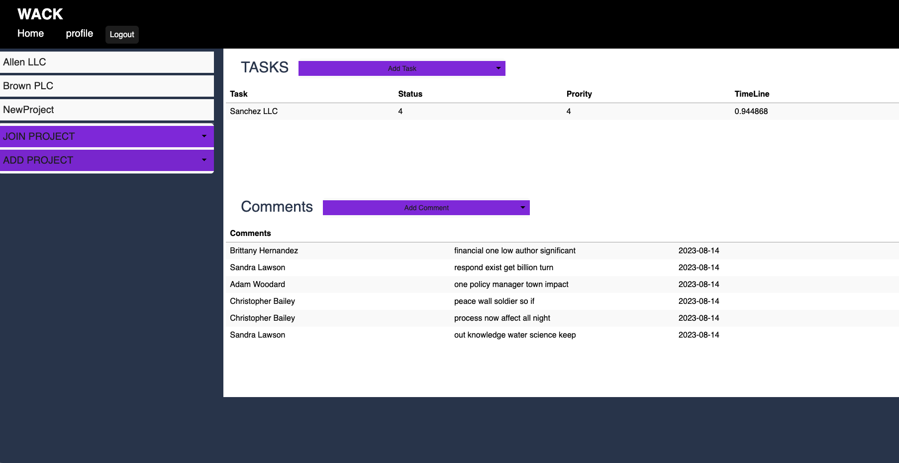
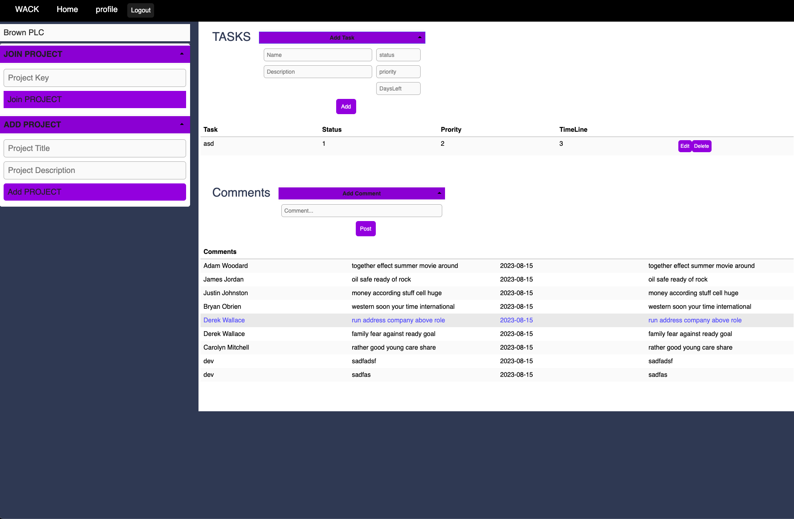

# WACK - Task Manager

## Description

Wack is designed to be a task/ project manager allowing users to join/create different projects, ad tasks within projects, and comments.

## User Story

- To be able to sign up and sign in,
  I can have information specific to me and interact with other users and projects

- Be able to create a project, so
  I can collaborate with other users to manage and add tasks to that project

- To be able to comment projects,
  so I can contribute and help build out peoples ideas

- To be able to add tasks to task list
  so, sers have a visual representation of all the tasks related to the project

- To be able to check off a completed task,
  so users know what has and has not been completed

## Mock-Up

## Features

- Ability to switch between projects by clicking on the title
- Edit through a popup, Delete, and create tasks
- Add comments
- Create a project, or join using a key
- Login/Signup pages

## Live Demo

This is a link to the live application:
[View Live](https://blooming-beyond-30251-89ceb9e97d3f.herokuapp.com/)

## NPM Packages

- Express
- bcrypt
- express-session
- handlebars
- mysql2
- sequelize
- uuid-int

## New Technology

- Sweet Alerts 2
- BlazeUI

## License

View "LICENSE" in Repository
